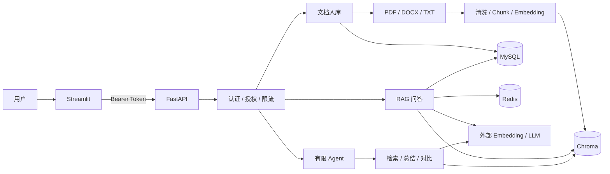
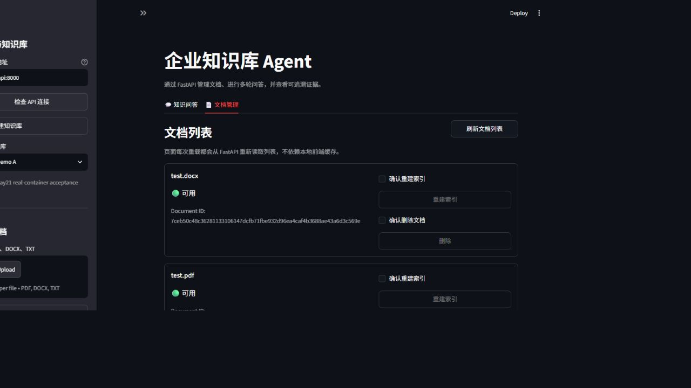
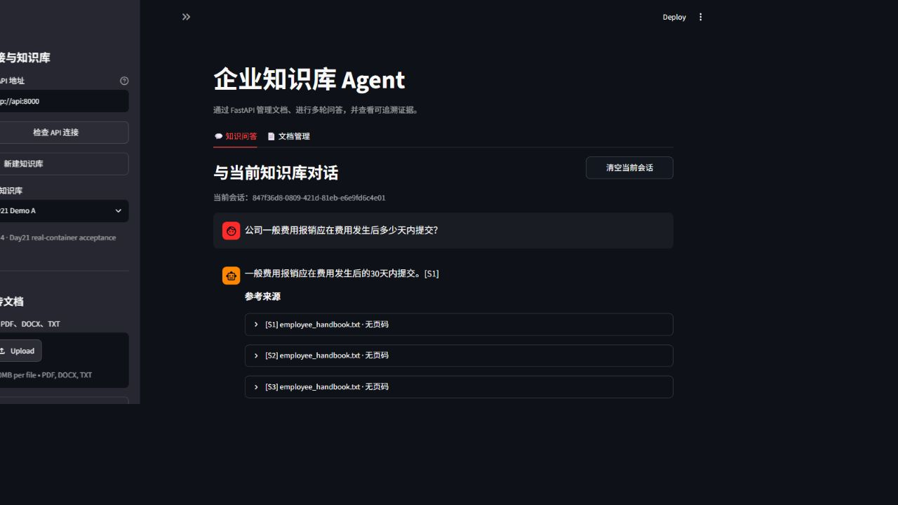
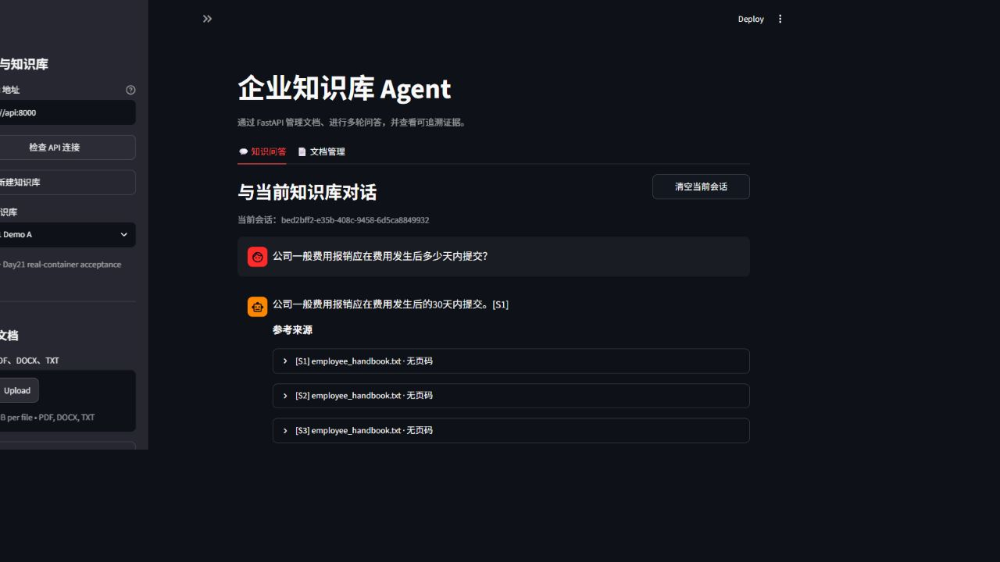

# Enterprise Knowledge Agent

> 面向企业文档的可追溯 RAG 与有限工具调用系统：支持多格式入库、知识库隔离、多轮问答、拒答、来源引用、固定集评测和容器化编排。

[](https://github.com/Anthony-7k/Python-Basics/actions/workflows/agent01-ci.yml)

## 项目解决什么问题

企业内部知识常分散在 PDF、Word 和文本文件中。普通关键词搜索难以理解语义，直接把整份文档交给大模型又会带来上下文成本、权限过滤和来源追踪问题。本项目把“解析 → 切分 → 向量检索 → 受约束生成 → 服务端引用回填”做成一条可测试的工程链路，并为信息不足、跨知识库、缓存失效、Prompt Injection 和受控 Agent 提供明确边界。

当前项目适合学习、作品展示和单机演示，不是已经完成生产合规审计的企业平台。

## 已实现能力

- PDF、DOCX、TXT 上传，文件类型/大小校验、文件名净化、内容哈希与幂等入库。
- 清洗、Chunk、Embedding、Chroma 向量索引；Vector、Hybrid（BM25 + RRF）和本地词法 Rerank 三种检索模式。
- 按 `knowledge_base_id` 强制过滤，多知识库所有者校验、文档删除与重建索引。
- 多轮会话、有限历史、追问改写、MySQL 消息持久化和来源摘要。
- 证据约束回答、信息不足拒答，以及由后端映射文件名、页码和 `chunk_id` 的可追溯引用。
- Redis 版本化缓存；知识库索引变化后避免旧答案继续命中。
- 三个白名单 Agent 工具：知识检索、单文档总结、双文档对比。
- Bearer 演示身份、资源所有者授权、进程内限流、请求 ID、结构化脱敏日志和 Prompt Injection 分层缓解。
- Streamlit 演示前端、FastAPI/OpenAPI、Alembic 迁移、160 项测试和 GitHub Actions 离线质量门槛。
- 非 root 多阶段镜像与 API/UI/MySQL/Redis Compose，真实 `/ready`、命名卷、只读根文件系统、资源限制和日志轮转。

## 架构



Streamlit 只通过 HTTP 调用 FastAPI；MySQL 保存业务关系和会话，Chroma 保存 Chunk/向量，Redis 只保存可重建缓存，上传原件单独持久化。详细组件职责、入库/问答时序和关键取舍见 [`docs/day21_architecture.md`](docs/day21_architecture.md)。

## 技术栈

| 层次 | 技术 |
| --- | --- |
| 前端 / API | Streamlit、FastAPI、Pydantic、Uvicorn |
| 数据 | SQLAlchemy 2、Alembic、MySQL、Chroma、Redis |
| 模型 | OpenAI-compatible LLM 与 Embedding API |
| 文档 | pypdf、python-docx、纯文本加载器 |
| 工程 | uv、pytest、Docker Compose、GitHub Actions |

## 快速启动：Docker Compose

前置条件：Docker Engine 24+ 或 Docker Desktop、Compose v2.24+，建议至少 4 GB 内存、2 CPU 和 10 GB 磁盘。

### 1. 配置环境变量

全新克隆可从 `.env.example` 创建 `.env`；如果 `.env` 已存在，只手动合并缺少的键，禁止覆盖原有模型配置。

必须替换：

- `LLM_API_KEY`、`LLM_BASE_URL`、`LLM_MODEL`
- `EMBEDDING_API_KEY`、`EMBEDDING_BASE_URL`、`EMBEDDING_MODEL`
- `DEMO_AUTH_USERS_JSON` 与使用同一 Token 的 `DEMO_API_KEY`
- `MYSQL_PASSWORD`、`MYSQL_ROOT_PASSWORD`

不要提交 `.env`，不要在截图或日志中展示真实密钥。Compose 会把 MySQL 密码放入连接 URL，建议使用随机的 URL 安全字母数字密码。

### 2. 构建并启动

```bash
docker compose config --quiet
docker compose up --build -d
docker compose ps
```

### 3. 检查服务

```bash
curl http://127.0.0.1:8000/health
curl http://127.0.0.1:8000/ready
curl http://127.0.0.1:8501/_stcore/health
```

- Streamlit：<http://127.0.0.1:8501>
- OpenAPI：<http://127.0.0.1:8000/docs>
- MySQL、Redis：仅 Compose 内部网络访问

`/health` 只表示 API 进程可响应；`/ready` 会检查数据库、Chroma、上传目录写入能力和启用状态下的 Redis。模型供应商网络不属于就绪检查。

> 2026-08-28 已在 Docker Desktop 上完成真实镜像构建、四服务健康、两次端到端演示、`down/up` 持久化、日志脱敏抽查、三类备份生成/可读性校验及经授权的覆盖式恢复演练。详见 [`docs/day21_demo_release_runbook.md`](docs/day21_demo_release_runbook.md)。

> 2026-08-31 又从远端 `main@0991533` 全新克隆，以独立镜像、端口和三类数据卷完成 `--no-cache` 构建、四服务健康、Alembic head、非 root/只读根文件系统、本地认证与知识库 CRUD、`down/up` 持久化、日志脱敏及 160 项离线回归。clean-clone 未在缺少具体数据外发授权时再次把样例发送给第三方模型；8 月 28 日原环境的两轮真实模型主链路证据仍然有效。

## 本地开发

要求 Python 3.11+ 和 uv。

```bash
uv sync --locked
uv run alembic upgrade head
uv run uvicorn app.main:app --host 127.0.0.1 --port 8000
```

另开终端启动前端：

```bash
uv run streamlit run frontend/app.py
```

本地方式需要自行准备 `.env` 中的数据库、Chroma、Redis和模型配置。若 Redis 缓存不可用，可将 `RAG_CACHE_ENABLED=false`；这不会替代 MySQL、Chroma 或模型依赖。

## 演示主链路

1. 创建知识库。
2. 上传仓库内的合成 TXT/PDF/DOCX，轮询到入库完成。
3. 提问可回答问题，核对答案及文件名、页码、`chunk_id`。
4. 提问信息不足问题，确认明确拒答且不伪造引用。
5. 运行一次单文档总结和一次双文档对比。
6. 刷新页面，确认会话历史仍可读取。
7. 在第二个知识库完整重复一次，并验证没有串库。

Day21 真实验收截图：

| 文档管理 | 问答与引用 | 刷新后历史恢复 |
| --- | --- | --- |
|  |  |  |

## API 概览

除 `/health`、`/ready` 外，`/api/v1/**` 都需要：

```text
Authorization: Bearer <token>
```

| 方法 | 路径 | 用途 |
| --- | --- | --- |
| GET | `/health` | 进程存活 |
| GET | `/ready` | 数据库、Chroma、上传目录、Redis 就绪 |
| POST / GET | `/api/v1/knowledge-bases` | 创建、列出知识库 |
| GET | `/api/v1/knowledge-bases/{id}` | 获取知识库 |
| POST | `/api/v1/documents` | 上传文档并创建后台入库任务 |
| GET | `/api/v1/ingestion/{task_id}` | 查询入库状态 |
| GET | `/api/v1/knowledge-bases/{id}/documents` | 列出知识库文档 |
| GET | `/api/v1/knowledge-bases/{id}/documents/{document_id}` | 获取文档 |
| POST | `/api/v1/knowledge-bases/{id}/documents/{document_id}/reindex` | 重建文档索引 |
| DELETE | `/api/v1/documents/{document_id}` | 删除文档（需查询参数 `knowledge_base_id`） |
| POST | `/api/v1/chat` | 多轮 RAG 问答 |
| GET | `/api/v1/conversations/{id}/messages` | 获取历史消息 |
| POST | `/api/v1/agent/run` | 运行有限 Agent |

## 评测结果

数据集 `employee-handbook-rag-eval/day17-v1` 共 50 题，Dev/Holdout 各 25 题，包含 40 个可回答问题和 10 个信息不足问题。

### 保存的真实模型响应

运行配置：`deepseek-chat`、`text-embedding-v4`、Vector Top-K 5、最大距离 1.1、Prompt `rag-prompt-day14-v1`。

| 指标 | 结果 |
| --- | ---: |
| 平均 0/1/2 分 | 1.98 |
| 2 分 / 1 分 / 0 分 | 49 / 1 / 0 |
| 事实覆盖率 | 100% |
| 事实一致率 | 100% |
| 回答相关率 | 100% |
| 拒答准确率 | 100% |
| 引用正确率 | 100% |

这是对 2026-08-23 已保存真实响应的确定性重放，只说明该固定数据集、模型、Prompt 与参数下的结果，不代表当前外部服务状态或生产流量。

### 离线 CI 门槛

2026-08-28 的 50 题离线哈希向量回归：Vector Recall@3 72.50%、MRR 70.00%、信息不足准确率 80.00%，门槛通过。离线哈希向量只用于稳定工程回归，不能作为生产 Embedding 质量或简历百分比。

真实 Embedding 的检索对比、失败样例、限制和发布矩阵见 [`docs/day21_evaluation_report.md`](docs/day21_evaluation_report.md)。

## 测试与质量门槛

```bash
uv run pytest -p no:cacheprovider
uv run python -m compileall -q app frontend eval tests
uv run python eval/eval_agent_routing.py --min-correct 10
```

Day17 评测命令支持 `--json-report`、`--csv-report`、`--markdown-report`。在有用户本地结果时，应把输出指向临时目录，避免覆盖已有报告。GitHub Actions 使用锁定依赖、占位配置、内存 SQLite 和禁用缓存的离线环境，不调用外部模型。

## 安全与可靠性边界

- Token 解析为明确用户，服务层统一校验知识库所有者；无权限资源与不存在资源都返回 404。
- 上传和 Chat/Agent 使用按用户、按入口隔离的进程内固定窗口限流，超限返回 429、`Retry-After` 和 `X-Request-ID`。
- JSON 日志只保留请求 ID、路由、状态、耗时和不可逆 actor ID 等元数据，不记录凭证、完整问答、Prompt 或文档正文。
- 文档证据被标记为不可信数据；授权、知识库过滤、工具白名单、参数 schema、步骤/超时和注入回归共同缓解 Prompt Injection。
- API/UI 容器使用非 root、只读根文件系统、移除 capabilities 和 `no-new-privileges`。

以上措施不等于生产 IAM、WAF、DLP 或完整合规体系。详细威胁模型见 [`docs/day18_security_threat_model.md`](docs/day18_security_threat_model.md)。

## 持久化、备份与关闭

Compose 的三个命名卷：

- `agent01_mysql_data`：业务关系、任务、会话和消息。
- `agent01_chroma_data`：Chunk、向量和检索元数据。
- `agent01_upload_data`：上传原件。

普通停止保留数据：

```bash
docker compose down
docker compose up -d
```

不要把 `docker compose down -v` 当成普通停止；它会删除三个持久卷。备份/恢复和故障排查见 [`docs/day20_deployment.md`](docs/day20_deployment.md)。恢复会覆盖数据，执行前必须确认目标与范围。

## 已知限制与 Roadmap

- OCR、扫描 PDF 和复杂表格解析未完成。
- 入库任务基于 FastAPI `BackgroundTasks`，不是可恢复的生产队列。
- 认证是演示 Token 映射，限流是进程内实现；尚无 SSO、精细 RBAC 和多实例共享策略。
- Hybrid 关键词分支扫描指定知识库全部 Chunk，尚未使用持久化稀疏索引。
- Agent 路由由关键词和文档数量驱动，只支持同一知识库内两文档对比。
- 尚未完成大规模压测和生产监控告警。

下一步优先级：可靠任务队列与幂等恢复 → 权限审计与 RBAC → 信息不足阈值校准 → 持久化关键词索引 → OCR/版面解析 → 压测、Tracing 与告警。

## Day21 交付材料

- [架构与关键调用链](docs/day21_architecture.md)
- [最终评测与验收证据](docs/day21_evaluation_report.md)
- [演示、最终验收与发布 Runbook](docs/day21_demo_release_runbook.md)
- [简历、3 分钟口述与两轮面试演练](docs/day21_interview_pack.md)
- [有限 Agent 设计](docs/day19_bounded_agent.md)
- [Docker、备份与恢复](docs/day20_deployment.md)

## 发布状态

项目版本已提升为 `1.0.0`。真实 Docker P0 验收、覆盖恢复、独立 clean-clone 复验、最终回归和 GitHub Actions `33164825390` 已通过；`main` 与 `v1.0.0` Tag 已普通推送。按用户最后指示未创建 GitHub Release；3–5 分钟演示视频暂缓录制和人工复核。
