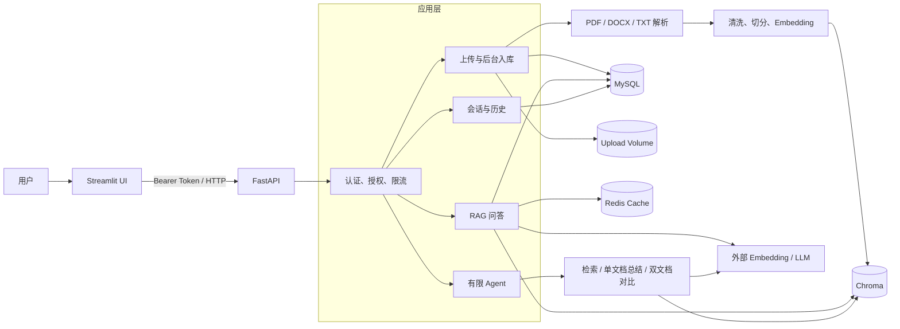
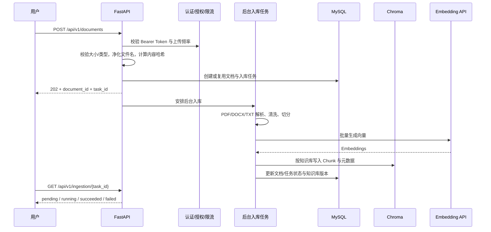
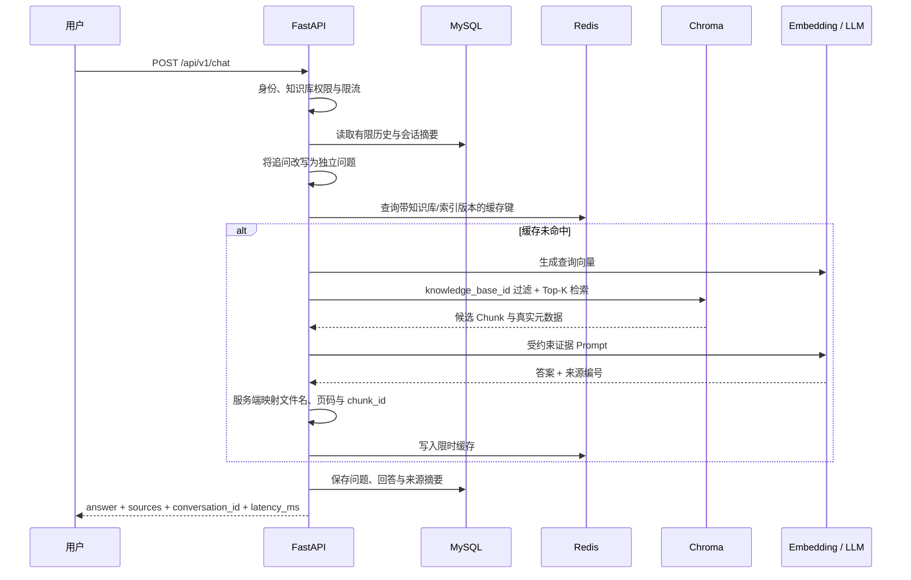

# Day21｜架构与关键调用链

## 1. 架构目标

Agent01 面向企业内部文档问答与分析场景，核心约束是：知识库隔离、答案可追溯、信息不足时拒答、Agent 工具调用受控，以及本地开发和容器部署使用同一套应用代码。

## 2. 组件职责

| 组件 | 主要职责 | 明确边界 |
| --- | --- | --- |
| Streamlit | 创建知识库、上传文档、轮询入库、聊天、展示引用与历史 | 只调用 FastAPI，不直连数据层或模型 |
| FastAPI | API 契约、身份解析、限流、请求 ID、服务编排 | `/health` 只表示进程存活，`/ready` 才检查依赖 |
| MySQL / SQLAlchemy | 知识库、文档元数据、入库任务、会话与消息 | 不保存向量；Compose 中使用命名卷 |
| Chroma | Chunk、向量与检索元数据 | 每次检索强制带 `knowledge_base_id` 过滤 |
| Redis | RAG 缓存 | 只存可重建数据，缓存键含知识库及索引版本 |
| 上传卷 | 保存上传原件，支持重新入库 | 可能含企业敏感数据，不得提交 Git |
| 有限 Agent | 在三个白名单工具间做确定性路由 | 不是开放式 ReAct；工具层再次校验权限与参数 |
| 外部模型 | Embedding、问答、总结与对比生成 | 网络与供应商状态不属于本服务的就绪检查 |

## 3. 文档入库调用链

当前后台任务基于 FastAPI `BackgroundTasks`，适合单机演示，不等同于可恢复、可重试、可水平扩展的生产任务队列。

## 4. 问答调用链

引用由后端根据检索结果映射，模型不能自行生成文件名或页码。文档证据被标记为不可信数据；Prompt Injection 防护还依赖授权、知识库过滤、工具白名单、结构校验与回归测试，不能宣称被完全消除。

## 5. 有限 Agent 调用链

`POST /api/v1/agent/run` 只允许以下三个工具：

1. `search_knowledge`：普通知识问答，复用 RAG 与来源结构。
2. `summarize_document`：校验目标文档后，读取数量与字符数受限的 Chunk。
3. `compare_documents`：分别校验同一知识库中的两个文档后再对比。

路由器只决定意图，执行层仍校验工具白名单、Pydantic 参数、用户身份、知识库范围、文档状态和资源上限。默认最多 2 个步骤、单工具 15 秒、总预算 25 秒；失败或超时即停止，不进入无限循环。

## 6. 部署与数据边界

Compose 包含 `api`、`ui`、`mysql`、`redis` 四个服务。API/UI 使用 UID/GID `10001`、只读根文件系统、`cap_drop: ALL`、`no-new-privileges` 和受控 `/tmp`。三个命名卷分别持久化 MySQL、Chroma 和上传原件；Redis 只存可重建缓存。

当前证据边界：2026-08-28 已在 Docker Desktop 完成镜像真实构建、四服务健康、Alembic head、两次主链路、`down/up` 持久化、日志脱敏抽查、三类备份生成/可读性校验，以及经明确授权的 MySQL/Chroma/Upload 覆盖式恢复演练。恢复后 A/B 文档、历史与引用均通过复验。

## 7. 关键取舍

- **分层单体而非微服务**：当前规模优先可测试边界、低部署成本和端到端可调试性；出现独立扩缩容或团队边界后再拆分。
- **确定性 RAG + 有限 Agent**：普通问答保持可预测路径，只在总结/对比等明确意图下调用白名单工具。
- **服务端回填引用**：牺牲部分生成自由度，换取文件名、页码、Chunk 的可追溯性。
- **MySQL / Chroma / Redis 分工**：业务关系、向量索引和可失效缓存分别保存，避免一个存储承担不匹配的职责。
- **离线 CI + 保存响应重放**：CI 不依赖外部模型网络；真实模型结果单独保存并带数据集、模型、Prompt 与参数版本。

## 8. 已知限制与下一步

- OCR、扫描 PDF 和复杂表格解析尚未完成。
- 入库使用进程内后台任务，不具备生产级可靠队列与任务恢复。
- 认证是演示 Token 映射，限流是进程内实现；尚无精细 RBAC、SSO 与多实例共享策略。
- Hybrid 关键词分支会扫描指定知识库全部 Chunk，数据量增大后需要持久化稀疏索引。
- Agent 路由由关键词和资源数量驱动，复杂含混意图需要调用方补充参数。
- 尚未完成大规模压测、生产监控告警和 OCR 质量评测。
